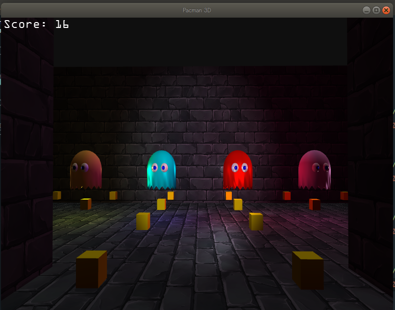
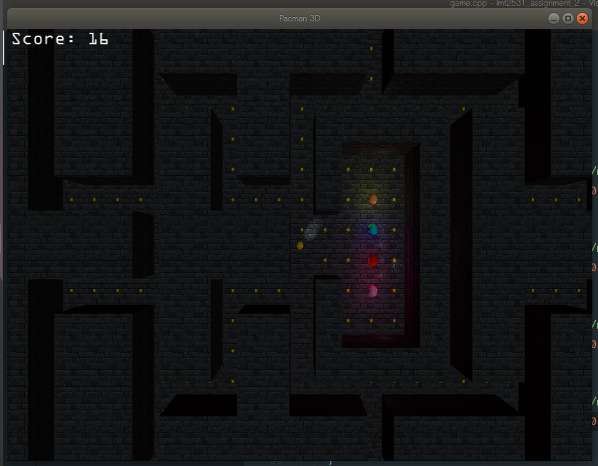

# OpenGL 3D PacMan

## Uses OpenGl Api to render everything on screen.
## Implements A star search algorithm

This project was made for assignment 2 in the course Graphics Programming - IMT2531.


## How to setup

Make sure you have [cmake](https://cmake.org/) version 3.14 or later installed.
Navigate to the root folder of the project and execute the following commands

On linux:
```
mkdir build
cd build
cmake ..
make
./Pacman3D
```

On windows:
```
mkdir build
cd build
cmake ..
cmake --build .
cd ..
cd out/build/x64-Debug
Pacman3D.exe
```

## Controls

W - Move player forward

A - Move player left

S - Move player backwards

D - Move player right

F - Toggle flashlight

M - Switch between first-person, third-person and top down view

LShift - Sprint

Esc - Pause the game

Arrow keys - Navigate the menu

Space - Make a selection in the menu

## Functionality

This game is shipped with the classic pacman map from assignment 1, now in 3D! Pacman can be moved around to collect the yellow cublets for points. At the same time he must dodge the ghosts chasing him. In this 3D version we fixed the collisions (sorry to the hardcore players who liked the challenge), no more getting stuck!

The game is supposed to look and feel like a horror game, thats why Pacman has a flashlight (we don't know how he's carrying it with no hands). This flashlight can be toggled on and off. We also added sprinting for those extra spooky moments when a ghost comes out of the corner. If playing in first-person isn't your cup of tea, don't fret! The game offers 3 different perspectives to play from, first-person, third-person and a top down view.

## Version History

[1.2](https://git.gvk.idi.ntnu.no/visarbuza/imt2531_assignment_2/-/commit/917213ac4b2185e3b3fb898b7cb3d69ec707917c) - Added a third person view

[1.1](https://git.gvk.idi.ntnu.no/visarbuza/imt2531_assignment_2/-/commit/96b489bfda288344ac2d7facd0af6566db1878bc) - Added a top down view

[1.0](https://git.gvk.idi.ntnu.no/visarbuza/imt2531_assignment_2/-/commit/b0b2448a7c1ca5e3dacdf3ecd141f32d3261ddc3) - Added victory and death

[0.94](https://git.gvk.idi.ntnu.no/visarbuza/imt2531_assignment_2/-/commit/8df4b7a6654ae50ef3c0cab979e2e5e792129822) - Added collisions

[0.93](https://git.gvk.idi.ntnu.no/visarbuza/imt2531_assignment_2/-/commit/695a21e1bf8840c2c1cb603fabe9ef8f9867175c) - Added lamps in the corners of the map

[0.92](https://git.gvk.idi.ntnu.no/visarbuza/imt2531_assignment_2/-/commit/85964ce6d333ca5a81d2d2ed45bd13fe4308e481) - Added text rendering

[0.91](https://git.gvk.idi.ntnu.no/visarbuza/imt2531_assignment_2/-/commit/694bfcc072cb03bfde64ae714b7a772e3e233562) - Added AI for ghosts

[0.9](https://git.gvk.idi.ntnu.no/visarbuza/imt2531_assignment_2/-/commit/21ce1fc005075ed88b0fe2be74b97e5ce6a27c0e) - Added menu

[0.8](https://git.gvk.idi.ntnu.no/visarbuza/imt2531_assignment_2/-/commit/015b04fb9f1f6a42c417c194074bb9b35173bf77) - Ghosts shine bright like a diamond

[0.7](https://git.gvk.idi.ntnu.no/visarbuza/imt2531_assignment_2/-/commit/fec9aec31e395c905745a86dcf9d64df58c9ffbe) - Added food for Pacman

[0.6](https://git.gvk.idi.ntnu.no/visarbuza/imt2531_assignment_2/-/commit/599034d4aabb5bce8d7d21e3fdbd973c98c59a47) - Rendered the map from a file

[0.5](https://git.gvk.idi.ntnu.no/visarbuza/imt2531_assignment_2/-/commit/4cee27a36e2a45e0a55f9955522ef140e1dee072) - Added developer console

[0.4](https://git.gvk.idi.ntnu.no/visarbuza/imt2531_assignment_2/-/commit/4225dc116fec106d8316103bf718641a41b85e86) - Added ghosts

[0.3](https://git.gvk.idi.ntnu.no/visarbuza/imt2531_assignment_2/-/commit/820c29a361bdbb74b3c7310c4a2edba0e6bd08ca) - Added a spotlight with the origin in the camera to act as a flashlight

[0.2](https://git.gvk.idi.ntnu.no/visarbuza/imt2531_assignment_2/-/commit/96b6b5d417333b23ec0d7006a2504e8038623cc4) - Added model loading

[0.1](https://git.gvk.idi.ntnu.no/visarbuza/imt2531_assignment_2/-/commit/4fa26029b3325c556ac84ee9530d4a8ddcce87c0) - Added a movable camera

## Members

- Ardit Baloku (arditbaloku@gmail.com / [@arditbaloku](https://git.gvk.idi.ntnu.no/arditbaloku))

- Visar Buza (visar.buza7@gmail.com / [@visarbuza](https://git.gvk.idi.ntnu.no/visarbuza))

- Fatbardh Kadriu (fatbardh.kadriu@gmail.com / [@Fatbardh_Kadriu](https://git.gvk.idi.ntnu.no/Fatbardh_Kadriu))

## Special mentions

Thanks to [Ludvig Lilleberg](https://git.gvk.idi.ntnu.no/ludvigli) for providing us with the ghost models 
